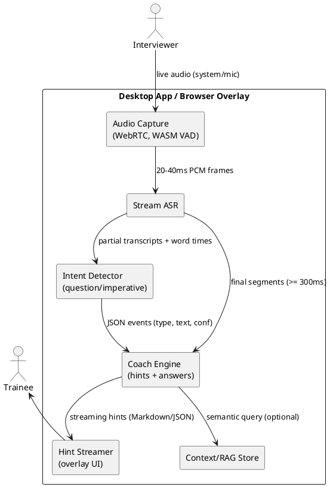

NOTE: This is a spec suggested by an AI rather than my detailed specification


# SPEC-001-Interview Assistant LLM Evaluation

## Background

**Purpose.** Evaluate and select the speech-to-text (ASR) + LLM stack for an interview-training assistant that:

- Transcribes the interviewer’s audio stream continuously.
- Detects questions and imperative phrases in near‑real‑time.
- Offers concise pointers and suggested answers to the trainee.

**Operating context (confirmed).** Real‑time assistance (≤ ~1.5s lag).

**Primary users.** Candidates practicing interviews (with a human coach or recorded/synthetic interviewer).

**Non‑goals.** Running in compliance‑sensitive *production* hiring interviews; long‑form meeting minutes; multilingual beyond English (initially).

**Initial success criteria (to refine).**

- End‑to‑end latency target ≤ 1.5 s from spoken word to on‑screen hint.
- ASR word‑error‑rate (WER) ≤ 10% on target accents; robust diarization.
- Question/imperative detection F1 ≥ 0.92 on an in‑domain eval set.
- Helpful response rate ≥ 85% (coach‑rated), hallucination rate < 2%.
- Cost ≤ $1.50 per hour of audio for ASR + LLM at scale.

**Assumptions.**

- English‑first (en‑US/en‑GB/en‑IN accents), roadmap to add others.
- Cloud APIs permitted (no strict EU‑only requirement at this stage).
- Sessions are recorded for offline analysis unless user opts out.

## Requirements

### Must‑have (M)

- **Low‑latency streaming ASR** with partial hypotheses, VAD, and word‑level timestamps.
- **Speaker focus**: ingest interviewer stream only (mix/minus or diarization to filter trainee voice).
- **Online intent detection**: classify **questions** vs **imperatives** with confidence per segment; expose JSON events.
- **On‑the‑fly coaching**: generate **pointers** (bulleted guidance) and **suggested answers** (1–3 sentences) within 1.5s SLA.
- **Safety & guardrails**: prevent harmful/biased content; cite uncertainty when ASR confidence < threshold.
- **Observability**: per‑turn logs (audio span → ASR text → intent → hint), latency breakdowns, cost tracking.
- **Eval harness**: in‑domain labeled set, automatic metrics (WER, F1, latency, $/hr) + human rating workflow.
- **Fallbacks**: degrade gracefully (e.g., heuristic question detection if LLM fails; ASR retry provider).

### Should‑have (S)

- **Domain adaptation**: lightweight job‑family prompts/playbooks (SWE, PM, DS, Sales).
- **Retrieval‑augmented hints** from a curated library (STAR method, leadership principles, etc.).
- **Noise robustness** and accent coverage for major English accents.
- **Session review UI** with timeline, misheard words, and better‑answer suggestions.

### Could‑have (C)

- Multilingual support; prosody/pace feedback; filler‑word analytics; TTS coach voice; camera‑aware body‑language cues.

### Won’t‑have (W) for MVP

- Production hiring use; offline/on‑device only; cross‑platform mobile native apps; live multi‑panel interviews.

### Model Evaluation Criteria

- **Latency**: first‑token time and full response time under streaming.
- **Accuracy**: intent F1, suggestion helpfulness (coach‑rated), groundedness.
- **Cost**: $/hr including ASR + LLM; peak concurrency behavior.
- **Features**: JSON mode/function‑calling, streaming, long context, RAG‑friendliness.
- **Stability**: rate‑limit headroom, retries, versioning, uptime SLAs.
- **Privacy**: opt‑out of training, data retention controls.

## Method

### High-Level Flow (MVP)



**Streaming contracts (events).**

- `asr.partial` → `{text, start_ms, end_ms, conf}`
- `nlp.intent` → `{type: question|imperative|other, conf, span}`
- `coach.hint` → `{bullets[], answer, sources[], conf, ttfb_ms}`

### Candidate Stacks (Shortlist)

**Option A — OpenAI Realtime (single vendor).**

- *ASR+LLM in one:* `gpt-realtime` (or `gpt-4o-mini-realtime`) for audio in → text + structured JSON out, function calling for UI events. Lowest integration effort; solid interruption handling.
- *Tradeoffs:* Pricing in audio tokens; vendor lock‑in; less control over diarization.

**Option B — Best price/perf split (recommended for MVP).**

- *ASR:* **AssemblyAI Universal‑Streaming** (sub‑second latency, built‑in end‑of‑turn) or **Deepgram Nova‑3/Flux** (P50 <300ms).
- *LLM (fast tier for realtime coaching):* **GPT‑4o‑mini / 4.1‑mini**, **Claude Haiku 4.5**, or **Gemini 2.5 Flash** (text‑only).
- *Why:* Lower cost than end‑to‑end realtime LLM; great accuracy; easy swapability.

**Option C — Self‑hosted ASR (cost control / offline path).**

- *ASR:* **Faster‑Whisper (Large‑v3 or v3‑Turbo)** with streaming policy + VAD; deploy on a single A10/A100 GPU.
- *LLM:* same as Option B.
- *Why:* Predictable cost, portable; slightly higher engineering effort and tuning for latency.

### Model Picks by Role (v0)

- **Intent Detector (question vs imperative).** Use a small LLM in structured‑JSON mode (e.g., GPT‑4o‑mini or Haiku 4.5) with constrained schema; backstop with regex heuristics on partials. Target P50 <100ms per call.
- **Coach Engine (hints & answers).** Use the same small LLM for speed; escalate to a larger model (Claude Sonnet 4.5 / GPT‑4.1) only when `difficulty=high` or `conf<τ`. Keep responses ≤ 220 tokens.
- **RAG.** Lightweight vector store (e.g., `qdrant` or `pgvector`) seeded with interview playbooks (STAR, leadership principles, role‑specific banks). Use top‑k=4, MMR, and pass citations.

### Data & Schemas (MVP)

- **Events (Kafka/WebSocket).**

```json
// nlp.intent
{"ts": 1731401234123, "utt_id": "a1", "span": [12500, 13840], "type": "question", "conf": 0.94, "text": "Can you walk me through..."}
// coach.hint
{"ts": 1731401234450, "utt_id": "a1", "bullets": ["Use STAR", "Tie to metrics"], "answer": "I scoped..., delivered..., impact...", "sources": ["STAR.md#intro"], "conf": 0.88}
```

- **RAG tables.**

```sql
-- pgvector
create extension if not exists vector;
create table doc (
  id bigserial primary key,
  title text,
  body text,
  embedding vector(1536),
  tags text[]
);
create index on doc using ivfflat (embedding vector_l2_ops) with (lists=100);
```

### Latency Budget (target ≤ 1.5s end‑to‑end)

- Capture + VAD: 50–100 ms
- ASR partials: 200–400 ms
- Intent detect: 50–150 ms
- Coach TTFB: 150–400 ms; stream tokens
- UI render: 50–100 ms

### Evaluation Plan (minimal)

- **Datasets:** 3 job families (SWE, PM, DS), 2 accents each, 60 mins labeled.
- **Metrics:** WER (ASR), F1 (intent), TTFB/latency (p50/p95), $/hr, coach helpfulness (human‑rated), hallucination rate.
- **A/B:** Option B vs Option A on the same sessions; gate launch on F1 ≥0.92 & latency ≤1.5s.
